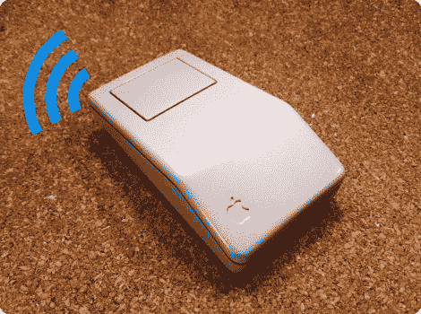

# 让怀旧的苹果鼠标无线化

> 原文：<https://hackaday.com/2012/10/04/making-a-nostalgic-apple-mouse-wireless/>

如果你有一个老式的鼠标，它有着完美的复古外观，为什么不重新开始使用它呢？我们打赌那里有足够的空间让输入设备无线化。

黑客除了箱子之外什么都做了。全新无线激光鼠标的内脏被用作替代品。在很大程度上，这是一个为新板腾出空间并将其放置到位的简单过程。它包括切掉一些塑料外壳的小块，扩大底部的孔，这样激光就可以清晰地看到桌面，然后用热胶将东西粘在适当的位置。按钮盖上粘有一点塑料，这样它就可以正确地与替换鼠标的开关对齐。

唯一不顺利的是电池的情况。老鼠需要的 AA 电池对于改造来说太大了，所以它被换成了 AAA 电池。它们的容量较低，这意味着需要更频繁地更换。

[通过[使](http://blog.makezine.com/2012/09/09/retrofitting-a-classic-mouse-with-wireless/)