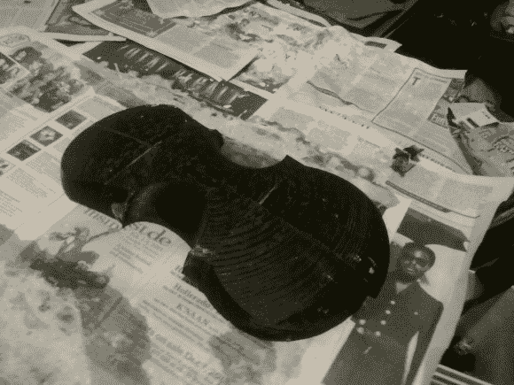

# 用 3D 打印机制作小提琴模型

> 原文：<https://hackaday.com/2013/02/27/making-a-violin-mold-with-a-3d-printer/>

一些人认为 3D 打印机是复制手镯、口哨和尤达头像的昂贵而缓慢的设备。在世界过渡到基于塑料章鱼的经济之前，我们这些拥有 3D 打印机的人将不得不为这些工具找到一些有用的东西。新斯科舍哈利法克斯的 Bayesian Empiritheurgy 想用他们的 3D 打印机为大规模分布式黑客空间竞赛“解构”做些有用的事情。他们最终用他们的打印机制作了一个纸型小提琴的模具[，并且最终相当成功。](http://thedeconstruction.org/team/bayesian-empiritheurgy/)

他们的纸制小提琴背后的基本想法是为恰好半个小提琴体创建一个塑料模具。这个街区覆盖着浸满小麦糊的报纸。一旦浆糊干了，小提琴的一半就从模具中取出，另一半就制作出来了。这些被缝合并粘在一起，形成了小提琴体。

琴桥、尾板、调音器和指板是 3D 打印的，并用环氧树脂固定在一起。环氧树脂弯曲得很厉害，所以每次一根弦被调准，它就会把其他三根弦的调准扔掉。在休息后的视频中，你可以看到正在演奏的纸糊和塑料小提琴。这对眼睛或耳朵来说不算什么，但每个人都玩得很开心，团队完成了玻璃纤维或碳纤维小提琴的概念验证，我们建议他们接下来试试。

[https://www.youtube.com/embed/nhEl0Hbzuds?version=3&rel=1&showsearch=0&showinfo=1&iv_load_policy=1&fs=1&hl=en-US&autohide=2&wmode=transparent](https://www.youtube.com/embed/nhEl0Hbzuds?version=3&rel=1&showsearch=0&showinfo=1&iv_load_policy=1&fs=1&hl=en-US&autohide=2&wmode=transparent)