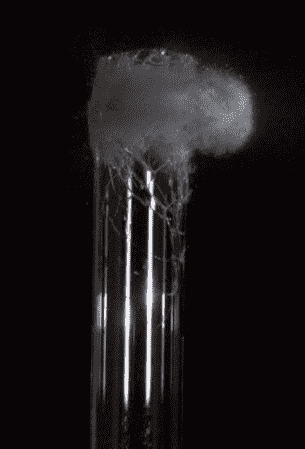

# 制造气隙闪光

> 原文：<https://hackaday.com/2013/10/22/making-an-airgap-flash/>

[Maurice]和他的团队刚刚完成了他们已经工作了一年的 [airgap flash](http://www.techphotoblog.com/tpb-67/) 。这种闪光灯适用于非常高速的摄影，例如拍摄子弹。持续时间约为百万分之一秒，是正常闪光最快速度的 30 倍。在插播的视频中，[Maurice]首先解释了他的闪光灯和通常使用氙闪光灯的传统闪光灯之间的区别，然后展示了他用自己的身材拍摄的不同照片。

尽管这个视频有点商业化，但[莫里斯]将制作另一个详细描述内部的视频。与此同时，你可以查看[用户手册](http://www.cameraaxe.com/files/airgap/Airgap_Flash_Manual_v0.7.pdf) (PDF)中的原理图，也可以看看他写的另一篇文章[，我们之前已经介绍过](http://hackaday.com/2011/01/10/diy-air-gap-flash-saves-at-least-seven-grand/)。我们还应该提到，试图在家里制作这种闪光灯是非常危险的，因为使用了非常高的电压(在这种情况下，16kV)。

[https://www.youtube.com/embed/kc3fFIetbeI?version=3&rel=1&showsearch=0&showinfo=1&iv_load_policy=1&fs=1&hl=en-US&autohide=2&wmode=transparent](https://www.youtube.com/embed/kc3fFIetbeI?version=3&rel=1&showsearch=0&showinfo=1&iv_load_policy=1&fs=1&hl=en-US&autohide=2&wmode=transparent)