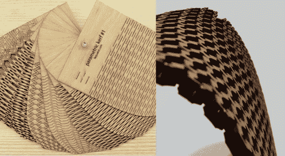
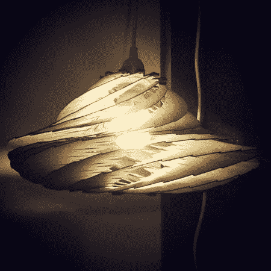

# 使用激光切割机制作柔性木材

> 原文：<https://hackaday.com/2014/06/26/making-flexible-wood-using-a-laser-cutter/>

如果你是能够使用激光切割机的幸运儿之一，你肯定会想看看(亚伦·波特菲尔德的)最新作品。他一直在试验制造弹性木材。

我们可能都见过木头切割时添加了插槽，以允许单个方向的灵活性，但您知道使用[网格铰链](http://www.deferredprocrastination.co.uk/blog/category/def-proc/lattice-hinges/)可以做更多事情吗？[Aaron 的]一直在玩参数化模式，并做出了一些非常酷的例子——最好的部分是，他免费分享它们(都是。DXF 和矢量文件)！

他的主要目标是创建一个在多个方向上灵活的图案，他几乎实现了这一目标——但他想到的真正酷的事情是通过首先在 Photoshop 中绘制弯曲来创建一个预先形成的曲面…

这是结果的一个例子——他提供了如何自己做这件事的完整说明，这打开了一个新的可能性的世界——同样，只有在你有激光切割机的情况下。尽管我们都可以做梦。