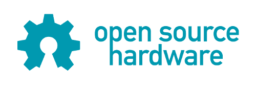

# 使得构建固件更加容易

> 原文：<https://hackaday.com/2013/03/28/making-it-easier-to-build-firmware/>

大多数微控制器制造商会在他们的芯片产品中提供一些免费的开发工具链或 IDE。通常它是残缺的，封闭的源代码，大量的下载。当你想拥有易于构建和发布的固件时，这是非常不方便的。我发现这些工具链中有很多用起来很烦人，而且要求闭源软件来构建开源固件似乎不太理想。

可以使用命令行工具为大多数微控制器构建代码。你需要一个编译器，设备制造商的库和头文件，以及一些刷新设备的方法。许多这些工具都是开源的，这让你有一个开源的工具链来构建你的项目。

设置这些工具可能有点棘手，所以我构建了一组[模板](http://uctools.github.com "uCtools")来使它更容易。每个模板都有设置工具链的说明、构建固件的 Makefile 和快速启动和运行的示例代码。这都是公共领域，所以你可以用它做任何你想做的事。

目前支持 AVR、MSP430、Stellaris ARM 和 STM32L1。更多的设备正在开发中，欢迎提出建议。希望这能帮助人们开始构建易于构建和发布的固件。