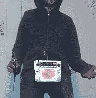

# 让卡拉 ok 变得更糟

> 原文：<https://hackaday.com/2013/02/06/making-karaoke-worse/>

卡拉 ok 不公平。不仅有不会唱歌的人选择唱非常难唱的歌，而且歌曲的种类也不是很多。为了让他经常光顾的酒吧的卡拉 ok 环境变得更好——或者更糟，这取决于你怎么看——【宇宙大事件】[现在将一种声音效果处理器](http://cosmicblooper.wordpress.com/2013/02/04/karaoke-bombing/)引入卡拉 ok。是的，现在他有了带他进入[比伯]领域的音高变换，以及模仿[T-Pain]和黑眼豆豆的自动调谐。

为了将合成器和效果的世界带到卡拉 ok 派对上，[cosmic blooper]拿了一个电池供电的 Kaoss Pad，并借助一些金属片将其连接到腰带上。一个 RCA 到 XLR 的适配器将 Kaoss Pad 连接到卡拉 ok 麦克风，而一个质量有问题的麦克风将[blooper]的声音转化为效果和音高移位器的可怕显示。

没有[宇宙大笨蛋]的卡拉 ok 机运行的视频，但他告诉我们他很快就会安装一台。