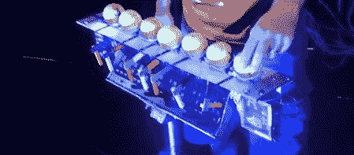

# 用网球和乐高制作音乐

> 原文：<https://hackaday.com/2012/08/05/making-music-with-tennis-balls-and-lego/>

我们已经看到了许多有趣的 MIDI 控制器，但这一个使用了一些非常规的材料。由[ [Audiobody](http://weareaudiobody.com "Audiobody") 制造的[世界上最酷的按键](http://weareaudiobody.com/worlds-coolest-keystroke "World's Coolest Keystroke")，由网球、乐高积木、伺服系统和开关组合而成。

当一个网球被举起时，一个乐高积木臂被启动。它看起来像一个伺服系统被用来移动乐高手臂，所以它击中了一个开关。Arduino 用于检测这种情况，并向他们的计算机发送消息。

他们使用该设备来控制 Ableton Live，并根据哪个网球被移走来播放不同的片段。这是一种用触觉界面控制声音的有趣方式，看起来非常漂亮。

休息之后是该设备运行的简短视频，但[Audiobody]表示，他们将很快发布更多信息。我们期待着看到其他有趣的控制器，他们已经在工作中。

[通过[使](http://blog.makezine.com/2012/07/27/tennis-ball-lego-ableton-controller/ "Make")

[https://www.youtube.com/embed/eJs6g7SuWR0?version=3&rel=1&showsearch=0&showinfo=1&iv_load_policy=1&fs=1&hl=en-US&autohide=2&wmode=transparent](https://www.youtube.com/embed/eJs6g7SuWR0?version=3&rel=1&showsearch=0&showinfo=1&iv_load_policy=1&fs=1&hl=en-US&autohide=2&wmode=transparent)