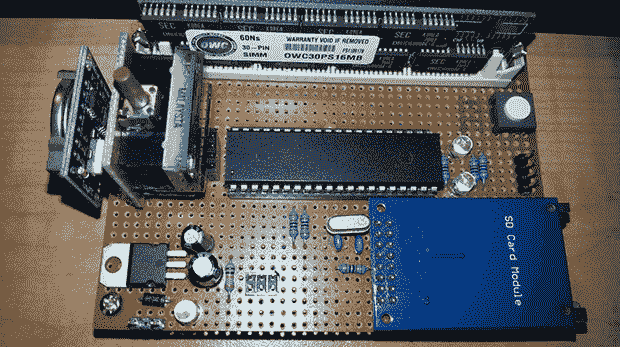

# 让最差的 Linux PC 变得有用

> 原文：<https://hackaday.com/2013/11/21/making-the-worst-linux-pc-useful/>

在看到[迪米特里]建造了有史以来最小的 Linux 计算机后，[凯尔]决定他自己也需要一台。以真正的黑客方式，他决定将最差的 Linux 个人电脑的这一版本更进一步:[他将把 I2C 添加到他的版本](http://www.wengenroth.co/projects/adding-i2c-to-the-avr-arm-emulator/)中，考虑到 I2C 外设的数量，使它有点用处。

这个版本是基于[Dmitry]的 ARM Linux 计算机在 8 位 AVR 上模拟的。这是一台成熟的 Linux 计算机，由 30 针 SIMM 提供 16 MB 内存，SD 卡提供大量存储空间，所有这些都运行在低级 ATMega1284p 内的仿真 ARM 处理器上。[凯尔]花了几个月的时间制造了这个克隆体，但从一开始他就决定要在这台极其特殊的计算机上实施 I2C 协议。

在启动他的计算机后，[凯尔]最终得到了一个由内核加载的 I2C 模块。有了一个 I2C 模块和几个备用的 GPIO 引脚，他开始创造一个可以连接到这台非常慢的电脑上的东西——一个古老的 LED 点阵显示器。有了实时时钟，在用 c 编写的自制程序的帮助下，这个显示器变成了一个时钟。考虑到仿真处理器的速度，该程序需要近三秒钟来读取 RTC 并向显示器显示当前时间。我们认为在这个时钟中只实现小时和分钟是一个明智的选择。

如果拥有一台运行频率约为 10*千*赫兹的有用计算机还不够的话，[凯尔]还编写了经典的基于文本的冒险*佐克。*它真的运行了，证明你不需要兆赫兹的能量就可以做一些有用和有趣的事情。