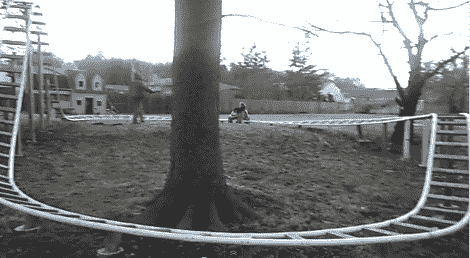

# 人力 PVC 过山车

> 原文：<https://hackaday.com/2012/08/11/manpowered-pvc-rollercoaster/>

秋千和丛林健身房对你的普通后院来说已经足够好了。但是如果你想走极端，你需要[建造你自己的后院过山车](http://www.youtube.com/watch?v=EBWloE7EKzQ)。

这个令人印象深刻的产品使用聚氯乙烯管的轨道。它最高时有 12 英尺高，使用经过压力处理的 4×4 木材作为支撑。经过压力处理的垫片横跨轨道，立柱固定在轨道中央。

休息之后你可以在视频里看得更清楚。这是一个由父母驱动的系统。给你的孩子系上安全带，然后用一根棍子把车推到山顶。我们只是喜欢在卡丁车回到起点之前，孩子已经在尖叫“爸爸又来了”！

它看起来没有我们前段时间看到的金属后院过山车那么快。但我们确实想知道他们是如何弯曲 PVC 管的，它们是否足够坚固，能够经受住时间的考验(尤其是暴露在阳光下)？

[https://www.youtube.com/embed/EBWloE7EKzQ?version=3&rel=1&showsearch=0&showinfo=1&iv_load_policy=1&fs=1&hl=en-US&autohide=2&wmode=transparent](https://www.youtube.com/embed/EBWloE7EKzQ?version=3&rel=1&showsearch=0&showinfo=1&iv_load_policy=1&fs=1&hl=en-US&autohide=2&wmode=transparent)