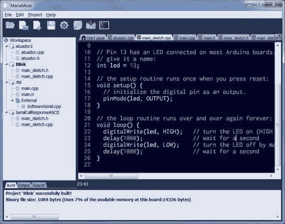

# Maria mole——面向高级用户的替代 Arduino IDE

> 原文：<https://hackaday.com/2012/11/29/mariamole-an-alternate-arduino-ide-aimed-at-advanced-users/>

[Alex]使用 Arduino 已经有一段时间了，但一直认为它缺少一些高级用户会真正发现有用的功能。他决定用一些空闲时间来解决这个问题，并最终为更高级的用户编写了一个 Arduino IDE。上面可以看到他的作品截图——名为 MariaMole。它明显不同于标准的 IDE，而不是吓退新用户。

这是对原始 IDE 的补充，因此它实际上使用这些配置设置作为依赖项。一旦运行，该程序允许您一次打开多个项目。这些是通过左侧列中的树和代码窗口顶部的一系列选项卡来管理的。到了编译和加载草图的时候，你可以像平常一样点击一个按钮，或者使用程序来微调你的编译器标志、库包含等等。它还允许通过一个或多个串行终端窗口进行交互。我们自己还没有尝试过，所以请在尝试后留下你的想法。

谢谢你的提示[罗德里哥]。