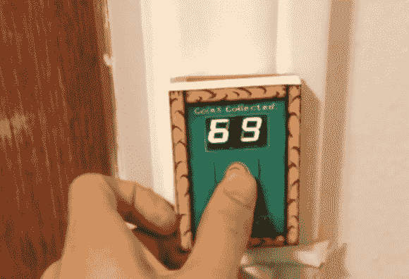

# 马里奥门铃保证让你疯狂

> 原文：<https://hackaday.com/2014/02/09/mario-doorbell-guaranteed-to-drive-a-you-a-crazy/>

你的门铃对你的客人来说不够刺激吗？[乔]想为他的访客提供一点娱乐，所以他用马里奥主题重新设计了他的门铃。

每当有人按下带有马里奥硬币图像的按钮时，片段显示就会增加，马里奥硬币声音就会播放。为了增加多样性，每 10 个硬币播放一次生命上升的声音，当达到 100 个硬币时播放蘑菇升级的声音。[乔]试图把生命上升的声音放在适当的 100 的位置，蘑菇的声音放在每 10，但他决定生命上升的短暂性在 10 的位置更能忍受。

该项目分为两个部分。门按钮有一个 PIC16F628A 微控制器，带有一个双 7 段 LED 显示屏，一个按钮和一个自制的电路板。所有这些都存在于一个简单的盒子里，盒子上盖着 *Yoshi's Island-* 主题贴纸。按钮板连接到一个独立的 ringer 板(基于 PIC16F87)，带有一个 MCP4822 DAC 和一个 25LC1024 EEPROM。按下第一块板上的按钮，会提示请求读取 EEPROM 上的声音片段。请继续点击下面的演示视频。

[https://www.youtube.com/embed/j20RfiTt6zI?version=3&rel=1&showsearch=0&showinfo=1&iv_load_policy=1&fs=1&hl=en-US&autohide=2&wmode=transparent](https://www.youtube.com/embed/j20RfiTt6zI?version=3&rel=1&showsearch=0&showinfo=1&iv_load_policy=1&fs=1&hl=en-US&autohide=2&wmode=transparent)