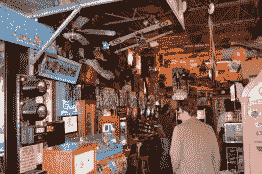

# 马文令人惊叹的机械博物馆

> 原文：<https://hackaday.com/2014/07/17/marvins-marvelous-mechanical-museum/>

不要叫它街机。它有类似街机的东西…像基于舞蹈的视频游戏、滑雪球和门票——哦，这么多门票。但是马文令人惊叹的机械博物馆是独一无二的，你下次去密歇根州底特律北郊的时候一定要去看看。

[马文]亲自在那里，因为他是很多天。他和我们聊了几分钟，我们已经把他的采访，以及许多景点的镜头，合并到上面的视频中。

他已经收集了三十多年了。这些吸引人的东西被装进了地板的每一点空间，溢出到墙上，悬挂在天花板的每一个地方。有来自国内外的真正的古董，可以被称为自动机，一排排的算命师，一排大型飞机模型，当喂给 25 美分硬币时，它们会绕着建筑转一圈，等等。

有些吸引人的地方是为他建造的，比如采访时你可以在[马文]身后看到的机器人乐队。这是一个基于 MIDI 的构建，允许从触摸屏上选择歌曲。即将展出的是一件基于特斯拉线圈的展品，这是[马文]在获得[尼古拉·特斯拉]最古怪博物馆排行榜第二名后委托制作的。

[https://www.youtube.com/embed/OFa2jO0Yyhg?version=3&rel=1&showsearch=0&showinfo=1&iv_load_policy=1&fs=1&hl=en-US&autohide=2&wmode=transparent](https://www.youtube.com/embed/OFa2jO0Yyhg?version=3&rel=1&showsearch=0&showinfo=1&iv_load_policy=1&fs=1&hl=en-US&autohide=2&wmode=transparent)

  Sign out front, entrance down the alley    There is a decent selection of pinball  Two of many fortune teller machines.  Puppets… come connected to machines and some not.  There are very high ceilings and interesting stuff everywhere.  Some of the more interesting oddities  Artwork fills the walls  Try to hold your hand in place  This machine came from england  A bit hard to see, but inside is a functioning guilotine  Brian was a big winner that night… battery operated bubble gun!