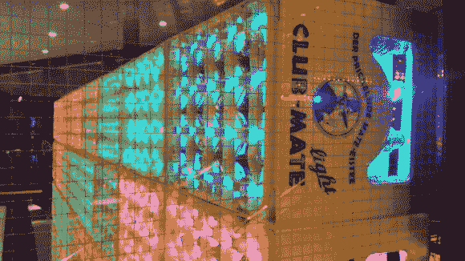

# 巨大的 LED 显示屏利用重复使用的汽水瓶

> 原文：<https://hackaday.com/2014/03/19/massive-led-display-makes-use-of-reused-soda-bottles/>

有什么比用旧空瓶子和酒瓶箱制作巨型 LED 显示屏更好的方法呢？这就是 [Mate Light](https://github.com/jaseg/matelight) (读作 Mah-Tay)。

在我们的[欧洲黑客空间之旅中，我们参观了第一批](http://hackaday.com/2013/11/06/hackerspacing-in-europe-conclusion/)黑客空间，在其中一个地方，我们第一次接触到了曾经很受欢迎的俱乐部伙伴汽水。这是一种产自德国的软饮料，似乎是西欧几乎所有黑客空间的独家非酒精饮料。荷兰和比利时的空间甚至会开车去德国，只是为了把酒装上货车带回家。就个人而言，我们真的不明白它有什么特别，但也许我们只是喝得不够多！

无论如何，这个令人印象深刻的展示使用了 640 个空瓶子，排列成 4 排，每排 8 个板条箱，分辨率为 16 x 40。每个瓶子都用铝箔包裹，包含一个带 WS2801 驱动器的 RGB LED。每一排板条箱都连接到 TI Stellaris Launchpad，它有四个硬件 SPI 接口，方便使用板条箱的排数！从那里，一台老式的 ThinkPad T22 笔记本电脑通过 USB 向微控制器板运行控制程序。他们的第一个软件实现使用了非常慢的 Python 脚本——他们现在正在使用 C 脚本进行最后的润色。

留下来看看所有令人惊叹的展示。

[https://www.youtube.com/embed/DIAmsq1D7eI?version=3&rel=1&showsearch=0&showinfo=1&iv_load_policy=1&fs=1&hl=en-US&autohide=2&wmode=transparent](https://www.youtube.com/embed/DIAmsq1D7eI?version=3&rel=1&showsearch=0&showinfo=1&iv_load_policy=1&fs=1&hl=en-US&autohide=2&wmode=transparent)

或者玩一个贪吃蛇的巨型游戏怎么样？

[https://www.youtube.com/embed/Gs3FFawl3Nk?version=3&rel=1&showsearch=0&showinfo=1&iv_load_policy=1&fs=1&hl=en-US&autohide=2&wmode=transparent](https://www.youtube.com/embed/Gs3FFawl3Nk?version=3&rel=1&showsearch=0&showinfo=1&iv_load_policy=1&fs=1&hl=en-US&autohide=2&wmode=transparent)

如果人群中有美女的话…

[https://www.youtube.com/embed/Xy4i5JZ1jVs?version=3&rel=1&showsearch=0&showinfo=1&iv_load_policy=1&fs=1&hl=en-US&autohide=2&wmode=transparent](https://www.youtube.com/embed/Xy4i5JZ1jVs?version=3&rel=1&showsearch=0&showinfo=1&iv_load_policy=1&fs=1&hl=en-US&autohide=2&wmode=transparent)

[谢谢斯图]