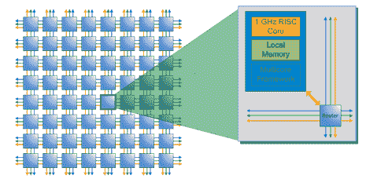

# 大规模并行计算机售价 99 美元

> 原文：<https://hackaday.com/2012/09/28/massively-parallel-64-core-computer-costs-99/>

尽管双核、四核和八核 CPU 已经出现了一段时间，但离真正的大规模并行计算平台还很远。芯片制造商 Adapteva 正在他们的 Parallella 项目中寻求将几十个 CPU 放在一个小封装中。作为奖励，[他们正在 Kickstarter](http://www.kickstarter.com/projects/adapteva/parallella-a-supercomputer-for-everyone?ref=live) 上寻找资金，并计划在资金到位后开源他们的 16 核和 64 核 CPU。

Parallella 计算机基于 ARM 架构，将能够运行 Ubuntu，具有 1g 内存、双核 ARM A9 CPU、以太网、USB 和 HDMI 输出。Parallella 的特别之处在于它的 Epiphany 多核加速器——一个包含多达 64 个并行内核的协处理器。

Adapteva 转向 Kickstarter 购买他们的 Parallella 计算机，以获得资金，将他们的 Epiphany 多核子板缩小到单个芯片中。一旦完成，Adapteva 将开始发运一台 ARM 驱动的 Linux 超级计算机，大约有信用卡大小，或在新的开发板测量系统下的树莓 Pi。

幸运的话，Parallella 多核计算机的售价将为 99 美元，远低于可比的 x86 多核计算机。看看 Parallella 未来能做什么肯定会很有趣。