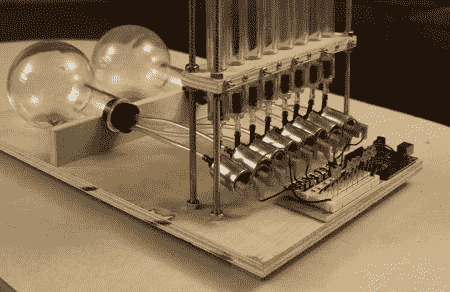

# [Matt 的]气泡显示已更新

> 原文：<https://hackaday.com/2012/05/11/matts-bubble-display-updated/>

[Matt]发来电子邮件向我们展示了自从上次我们看到气泡显示以来，他是如何改进气泡显示的。如果你记得上次的[，当多个气泡被释放时，他遇到了气压下降的问题，导致了更小的气泡。这一次，他增加了一个美观的储气筒，以确保他的气泡不会变化太大。除了他手头上有两个容器之外，真的没有理由用两个容器来储存。他还撕掉了显示屏上存放石油的部分，用单独的管子代替了每个垂直部分。这使得调节气泡的速度变得更加容易，因为他发现如果气泡接触到管子的边缘，它们就会以恒定的速度运动。](http://hackaday.com/2012/04/06/displaying-bubbles-in-mineral-oil/)

使用乙烯管的一个缺点是它是一个巨大的卷。这使得管子想要卷曲。为了解决这个问题，他把它放在一个木钉上，用热风枪加热，直到它松弛。使用透明 PVC 或丙烯酸管是一种替代方法，但会更贵。

[https://www.youtube.com/embed/EBeHYoKn_v8?version=3&rel=1&showsearch=0&showinfo=1&iv_load_policy=1&fs=1&hl=en-US&autohide=2&wmode=transparent](https://www.youtube.com/embed/EBeHYoKn_v8?version=3&rel=1&showsearch=0&showinfo=1&iv_load_policy=1&fs=1&hl=en-US&autohide=2&wmode=transparent)