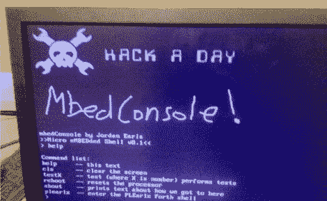

# Mbed 和一些电阻运行控制台、VGA 和 PS/2

> 原文：<https://hackaday.com/2012/09/30/mbed-and-a-few-resistors-runs-console-vga-and-ps2/>

[Jordan]来信向我们展示了他一直从事的一个名为 [MbedConsole](http://lastyearswishes.com/blog/view/50687bc2d1f1a503adc7287e) 的项目。名副其实的[Jordan]已经设法从 mbed 本身运行 640×480 VGA 输出、PS/2 端口和控制台。我们真正的意思是仅从 mbed 除了几个电阻器和连接器、VGA 显示器和 PS/2 键盘之外，不需要额外的硬件。代码是开源的，链接包含在博客中。甚至还有包括你自己的图形的说明。

还有一些事情需要解决，比如 SD 卡支持。目前，大写锁定的 PS/2 键盘灯不起作用。[Jordan]很想知道我们还会在这样的东西上看到什么，400k 的闪存和 20k 的 RAM 肯定会为一些有趣的东西留下一点空间。他的主要目标之一是摆脱 C 界面，移植一个交互式外壳，可以做一些类似 BASIC 或 Forth 的事情(给它复古的环境感觉)。我们已经在一些项目中看到了 mbed，你怎么看？