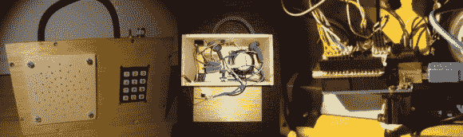

# MBox:儿童 MP3 播放器

> 原文：<https://hackaday.com/2014/01/15/mbox-a-childs-mp3-player/>

对于小孩子来说，音乐是一件美妙而令人兴奋的事情——但是你真的想让他们玩你的手机，或者更糟的是 iPod 吗？[Arons]决定制造 MBox，一款 Arduino 驱动的 MP3 播放器。

他的灵感来自于一款非常相似的木制儿童 MP3 播放器[HR Bert](https://en.hoerbert.com/)。显然这是一个伟大的产品，但它也需要 239€。我们不怪他想自己做。

MBox 遵循了与赫伯特相同的外观设计——尽管我们必须承认，他本可以增加一点趣味！它以 Arduino Uno 为核心，带有 Freaduino MP3 音乐屏蔽，能够播放所有典型的格式，如 MP3，MIDI，WAV，甚至 Ogg Vorbis。为了放大声音，他使用了 SparkFun 的单声道音频放大器分线板，驱动 8ω扬声器。一个迷你 USB 电源模块提供电源，一个 12 位数字键盘提供选择音乐的能力——每个数字从 SD 卡上的不同目录播放。

女儿很喜欢，他可能只花了真正的赫伯特五分之一的钱！

谢谢你的提示，伦佐！]