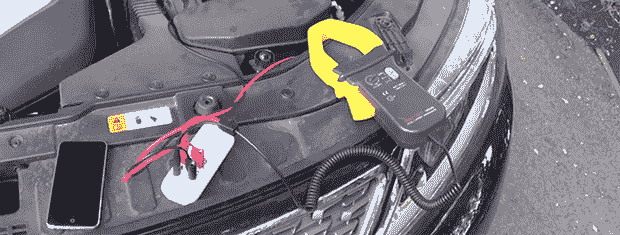

# 测量电路中的 185ω电阻

> 原文：<https://hackaday.com/2014/01/27/measuring-185-%c2%b5%cf%89-in-circuit/>

为了测量电阻，通常需要将被测电阻从电路中取出，有时这是不可能的。如果你使用万用表，测量非常小的电阻是很困难的。将这两个问题结合起来——在线测量微欧姆—[,你就有了一个非常适合 Mooshimeter 的问题](http://moosh.im/?p=846&preview=1&_ppp=6f04b4c8d6)。

[几周前发布的](http://hackaday.com/2014/01/08/mooshimeter-the-why-didnt-i-think-of-that-multimeter/)，Mooshimeter 是一款双通道万用表，通过蓝牙与你的手机进行通信。它非常适合同时测量电流和电压，同时被藏在一些危险、难以接近或移动的地方。

Mooshimeter 团队提供了一个很好的例子，通过测量方向盘后面的汽车电池接地带的电阻，可以用他们的电表做什么。为此，他们将鳄鱼夹放在接地电缆上，并夹在电流表上。

在车内，他们拿出手机，查看 Mooshimeter 的电压和电流测量输出。Mooshi 应用程序有一条 IV 曲线(线性回归正在进行中)，所以简单地划分电流和电压就可以得到电池接地电缆的电阻。

这是一个非常酷而且非常简单的演示，展示了 Mooshimeter 到底有多酷。下面的演示视频。

[https://www.youtube.com/embed/aS8hlYUBxyE?version=3&rel=1&showsearch=0&showinfo=1&iv_load_policy=1&fs=1&hl=en-US&autohide=2&wmode=transparent](https://www.youtube.com/embed/aS8hlYUBxyE?version=3&rel=1&showsearch=0&showinfo=1&iv_load_policy=1&fs=1&hl=en-US&autohide=2&wmode=transparent)