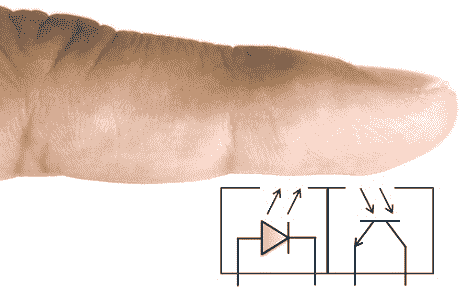

# 用红外光测量脉搏

> 原文：<https://hackaday.com/2012/09/13/measuring-a-pulse-with-infrared-light/>

下次你不幸去医院、急诊室或紧急护理诊所时，你会被要求在手指上安装一个小型脉搏监测器。护士夹在你剩下的一个手指上的设备叫做光电容积描记传感器，基本上它能够通过反射光读取你的脉搏。为了找出这些设备实际上是如何工作的，[Raj] [发送了一个很棒的教程](http://embedded-lab.com/blog/?p=5508)涵盖了光电体积描记术背后的理论，并且还建立了一个简单的设备来检测脉搏，而不使用微控制器。

这些光电体积描记传感器的工作原理是将光线照射到某人的肌肉上——通常是手指或耳垂——并记录反射回光源的光线。手指中的血量会影响反射回来的光量，这是自动测量某人心率的完美方法。

为了建造他的设备，[Raj]使用了一个 [TCRT1000 反射式光学传感器](http://www.vishay.com/optical-sensors/list/product-83752/)。这个传感器内部是一个红外 LED 和一个光电晶体管。当然，将手指放在传感器上，环境光和一块肉反射光的基本速率都会产生大量噪声。[Raj]将其过滤掉，只留下反射光量的微小变化，从而创造了一个非常简单——也非常便宜——的电子脉搏计。