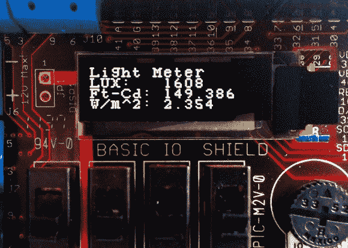

# 用芯片套件测量光线

> 原文：<https://hackaday.com/2014/04/24/measuring-light-with-chipkit/>

如何测量给定区域的光量？当然是带测光表的！在学校、医院甚至你自己的工作台上，保持适当的照明水平是非常重要的。

嵌入式实验室的[Raj]已经整理了一个很好的教程，教你如何基于 chipKIT 平台构建自己的[测光表](http://embedded-lab.com/blog/?p=8486)。chipKIT Uno32 类似于 Arduino，但拥有更强大的 PIC32MX320F128 微控制器。我们以前在这里看到过以[芯片套件 Uno](http://www.digilentinc.com/Data/Products/CHIPKIT-UNO32/chipKITUno32_rm.pdf) (pdf 警告)为特色的项目。从[玩 pong](http://hackaday.com/2011/07/16/vga-pong-on-a-chipkit/) 到托管几个[温度传感器](http://hackaday.com/2011/11/02/chipkit-temperature-shield-supports-a-dozen-sensors/)，这当然是一个多功能的平台。

测光表使用 I/O 屏蔽，并通过 I2C 与 [BH1750FVI 数字光传感器](http://www.elecrow.com/sensor-c-111/light-sound-c-111_125/digital-light-sensor-p-403.html)通信。固件将来自传感器的原始数据除以一个常数，并在 OLED 显示器上以勒克斯、英尺烛光和 Watts/m^2 单位显示光强数据。请务必检查完整的原理图和源代码教程。