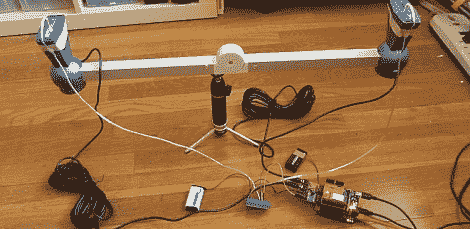

# 用开放式计时器测量射弹

> 原文：<https://hackaday.com/2012/05/23/measuring-projectiles-with-openchronometer/>

[Spork]在 Netduino 论坛上，他想推动他的小板子所能做的极限。他用兼容 Arduino 的 CPLD 盾组装了一个计时器来测量步枪子弹和 Nerf 飞镖的速度。

该项目是围绕一对商业 CED M2 计时传感器；因为人们倾向于拍摄*到*这些传感器，它们可以作为替换单元，比一套完整的计时装置的成本低得多。[斯博克]找不到一种方法让他的 Arduino 克隆体以 1 微秒的分辨率读取 pin 码，所以一个[阿玛尼·GTX·CLPD 盾](http://amani64.com/amanigtxhw.htm)被添加到了这个构建中。该可编程逻辑芯片从计时器传感器获取输出，启动计时器，等待第二个传感器触发，然后停止计时器。由此，几乎任何射弹的速度都可以计算出来。

当然，[斯博克]需要测试他的新设备，所以他把它拿到靶场，通过他的计时器发射了 25 发步枪子弹。结果是一个非常好的正态分布，以每秒 2400 英尺为中心，完全符合预期。虽然[Spork]没有测试像 Nerf 飞镖这样的低速射弹，但我们期待同样可靠的结果。

via [majolsurf](http://majolsurf.net/wordpress/?p=1930)