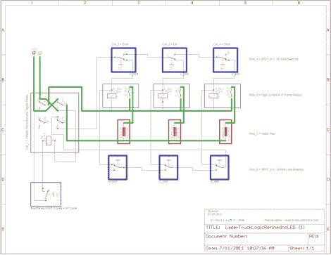

# 被微控制器冷落的机械继电器逻辑

> 原文：<https://hackaday.com/2012/07/30/mechanical-relay-logic-that-was-snubbed-for-a-microcontroller/>

[Alex]负责一组电机的控制设计问题。该应用程序要求打开卡车的后部，一些 3D 扫描设备从其外壳中升起，最后设备需要旋转到位。所有这一切都需要按一下开关，然后在开关关闭时反过来进行。我们可以理解为什么最后的设计用了微控制器，但我们也认为【Alex 的】[继电器逻辑电路是一种雄辩的做事方式](http://brainlubeonline.com/relaylogic/)。

他使用限位开关作为逻辑的反馈回路。在休息后的视频中，他向我们展示了原理图。三个电机中的每一个都有一个上下限位开关。它们控制三个继电器，将电源切换到电机。我们喜欢这种设计，因为中途中断机芯不会给系统带来任何问题。我们看到的唯一真正的问题是继电器磨损，硬件的汽车应用可能会导致这种情况比正常情况发生得更快。

您可能会认出演示中使用的透明齿轮。[Alex]之前向我们展示了他是如何制作这些的。

[https://www.youtube.com/embed/BpQH_4jfrHk?version=3&rel=1&showsearch=0&showinfo=1&iv_load_policy=1&fs=1&hl=en-US&autohide=2&wmode=transparent](https://www.youtube.com/embed/BpQH_4jfrHk?version=3&rel=1&showsearch=0&showinfo=1&iv_load_policy=1&fs=1&hl=en-US&autohide=2&wmode=transparent)