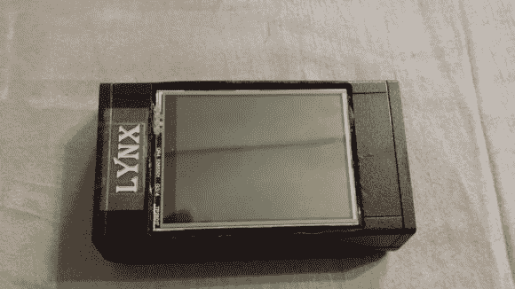

# 见见 Lynx，一个(昂贵的)离线密码管理员

> 原文：<https://hackaday.com/2014/03/19/meet-lynx-a-costly-offline-password-keeper/>

也许是因为他不想等着 Mooltipass 被生产出来，[davidhend]给自己建了自己的[离线密码保管器](http://www.instructables.com/id/Lynx-Offline-Password-Keeper/?ALLSTEPS)，取名 Lynx。

它基于 Arduino Pro 328、2.8 英寸 TFT 触摸屏、RFID 读卡器、FTDI 基本分线点以及锂离子电池。因此，Lynx 是自供电的，并使用 RFID 卡来读取位于 SD 卡中的 XOR 加密的密码。USB 串行连接用于将密码发送到计算机，同时也为电池充电。目前的 BoM 成本约为 220 美元，但我们非常肯定，如果不使用预制板，它的成本会低得多。查看[官方 GitHub 库](https://github.com/davidhend/Lynx)告诉我们 XOR 密钥存储在微控制器中，Lynx 检查 RFID 卡代码以允许加密/解密。

另外，我们最近在官方的 [Mooltipass GitHub](https://github.com/limpkin/mooltipass) 上发布了一个常见问题。欢迎您让我们知道我们可能忘记了哪些问题。