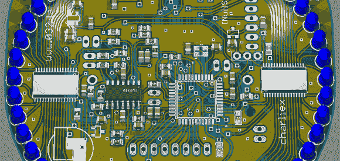

# 认识 2013 LayerOne 会议徽章

> 原文：<https://hackaday.com/2013/05/21/meet-the-2013-layerone-conference-badge/>

LayerOne 安全会议即将召开，[charliex]正在尽最大努力为今年的会议徽章做最后的润色。

徽章周围有 48 个 LED，由两个 LED 驱动器驱动。这使得一些疯狂的硬件黑客可以创造出从电视到[灯泡钟](http://hackaday.com/2010/08/28/prototyping-the-bulbdial-clock/)的任何东西。还有一些额外的开关和传感器可以被黑客攻击来做一些有趣的事情，但这个徽章真正闪光的地方是增加了一个有机发光二极管显示器，允许它转变成一个 [XMEGA Xprotolab](http://www.gabotronics.com/development-boards/xmega-xprotolab.htm) ，一个小型示波器，频谱分析仪和频率发生器。是的，这个徽章是可以被黑的，但它也是一个被黑的工具。

这个徽章有大量的工作要做，考虑到 LayerOne 会议[在本周末](http://www.layerone.org/layerone-this-weekend-pre-reg-closes-may-21st/)举行，这些徽章的 PCB 要到明天才能到达，这一壮举更加令人印象深刻。我们会第一个说我们是拖延症的大师，但是[charliex]真的在这里切断了它。