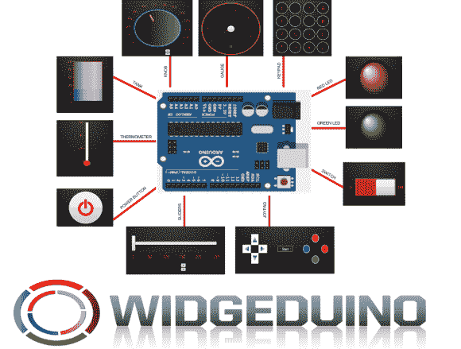

# 见见 WIDGEDUINO

> 原文：<https://hackaday.com/2014/06/21/meet-the-widgeduino/>

Arduino 因易于使用而闻名，并已成为一个想法快速原型化的优秀工具。如果一个人在半夜醒来，突然灵机一动，敲打出一个奇妙的装置——使用 Arduino 作为大脑是最快最容易的。

也就是说， [WIDGEDUINO](http://hackaday.io/post/3764) 旨在让这一过程变得更快、更简单。WIDGEDUINO 配备了一系列仪表、图表和数据输入小工具，肯定会受到黑客、制造商和工程师的欢迎。

它基于。NET 框架，是用 Visual Studio Windows Presentation Foundation 设计的。用户只需使用 WIDGEDUINO 库写一个草图，并通过串行或以太网连接到 PC，就可以访问各种令人惊叹的小部件。

你可以在这里找到[几个例子](http://www.widgeduino.com/control-widgets.html)。我们希望创作者能让我们了解这个令人印象深刻的项目的最新进展。休息之后，请务必留下来观看视频，演示 WIDGEUINO 的功能。

[https://www.youtube.com/embed/1PPt_nH2tzA?version=3&rel=1&showsearch=0&showinfo=1&iv_load_policy=1&fs=1&hl=en-US&autohide=2&wmode=transparent](https://www.youtube.com/embed/1PPt_nH2tzA?version=3&rel=1&showsearch=0&showinfo=1&iv_load_policy=1&fs=1&hl=en-US&autohide=2&wmode=transparent)