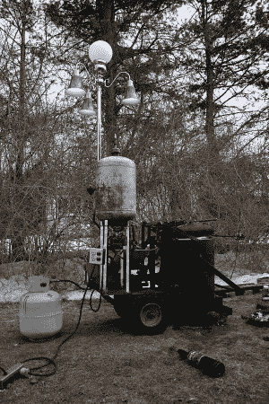

# 用 DIY 铸造炉熔化金属

> 原文：<https://hackaday.com/2013/04/04/melting-metal-with-a-diy-foundry-furnace/>

如果你想在家铸造，你需要一种熔化金属的方法。[杰克]的 [DIY 铸造炉](http://steampunkworkshop.com/foundry-furnace-final "Foundry Furnace")温度高到足以熔化铝，由废弃零件混合而成。

炉子的炉膛是由一个热水器水箱建造的，水箱内衬有一种特殊的水泥，可以折射热量。炉子由巴宾顿燃烧器加热。这种燃烧器的工作原理是将燃料雾化并喷入炉膛。它们有利于燃烧废油以获得高热。

一个报废的大众油泵和一个无绳电钻用来给燃烧器供油。一旦点火，熔炉需要大约 10 分钟来熔化它所能容纳的 11 磅金属。[杰克]在 2 小时内从废弃的合金车轮上熔化了大约 40 磅的铝合金，这对于一个家庭铸造项目来说应该绰绰有余。

休息之后，请查看设备概述和熔化铝的演示。

[https://www.youtube.com/embed/M03ceSJnAzc?version=3&rel=1&showsearch=0&showinfo=1&iv_load_policy=1&fs=1&hl=en-US&autohide=2&wmode=transparent](https://www.youtube.com/embed/M03ceSJnAzc?version=3&rel=1&showsearch=0&showinfo=1&iv_load_policy=1&fs=1&hl=en-US&autohide=2&wmode=transparent)

[https://www.youtube.com/embed/ddwrXA67bb4?version=3&rel=1&showsearch=0&showinfo=1&iv_load_policy=1&fs=1&hl=en-US&autohide=2&wmode=transparent](https://www.youtube.com/embed/ddwrXA67bb4?version=3&rel=1&showsearch=0&showinfo=1&iv_load_policy=1&fs=1&hl=en-US&autohide=2&wmode=transparent)