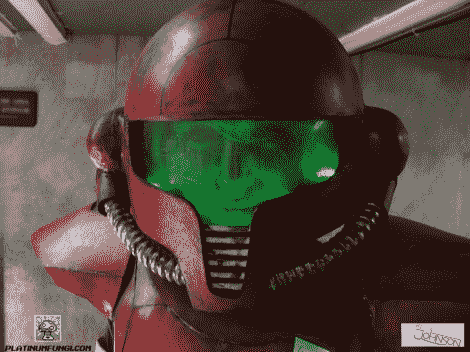

# 银河战士头盔将万圣节服装提升到了一个新的高度

> 原文：<https://hackaday.com/2012/10/23/metroid-helmet-takes-halloween-costuming-to-a-higher-level/>

黑客作家[Ryan Fitzpatrick]，又名[platinum fungus]，最近在 youtube 上组装了这个惊人的 Metroid 动力服头盔，作为[[迈克·n·加里](http://www.youtube.com/user/mikeNgary)的道具。有多神奇？这张图片是头盔的真实照片！它是由[凯莉·约翰逊]设计的，她为去年的万圣节设计了一套动力套装。但是她从来没有做过头盔，这对我们来说是有意义的。毕竟，你戴着头盔怎么和别人说话呢？除了实用性，这是一个愉快的经历制作过程。

[Ryan]从一个摩托车头盔开始，根据游戏中的图像制作纸质模板。在他对需要完成的工作有了一个合理的路线图后，他开始砍掉不需要的部分。前面的“喙”由纸板制成，侧面的鳍由硬质泡沫塑料制成。但是从这一点来说，还有很多工作要做。当然，内部照明和彩色遮阳板是必要的触摸，但它的油漆工作和“令人苦恼”的步骤，使这个看起来如此现实。

看起来我们已经超过了他的带宽，因为他有大量的过程照片。休息之后请看视频。

[https://www.youtube.com/embed/HzOXtF2WAbg?version=3&rel=1&showsearch=0&showinfo=1&iv_load_policy=1&fs=1&hl=en-US&autohide=2&wmode=transparent](https://www.youtube.com/embed/HzOXtF2WAbg?version=3&rel=1&showsearch=0&showinfo=1&iv_load_policy=1&fs=1&hl=en-US&autohide=2&wmode=transparent)