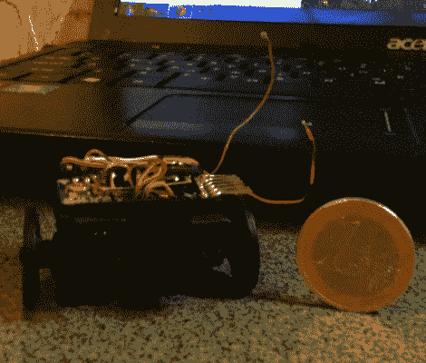

# 微型 Arduino 机器人潜入我们的内心。

> 原文：<https://hackaday.com/2012/04/26/micro-arduino-bot-skitters-its-way-into-our-hearts/>

这里有一个快速简单的小机器人，它的大脑不是那么小。[Dikos]在 grobot，拼凑了一些被掏空的微型伺服系统，一个 Arduino pro mini，H bridge 芯片，和一个[太阳能钥匙链充电器](http://www.dealextreme.com/p/solar-powered-1350mah-rechargeable-portable-emergency-power-with-phone-adapters-30012?item=13)来制作这个小三轮可爱。由于夏普 GP2Y0A21YK 模拟红外距离传感器，机器人拥有一些非常简单的物体回避功能，仅此而已。这使得大量的 Arduino Pro 留给了大量的传感器和机器人。我们无法发现它，但在 pro mini 下面的某个地方是太阳能钥匙链的 3.7V Lipo 电池。紧急充电器的 PCB 也是一个方便的小背板，包含几个 led，充电电子设备，以及一个方便的挂珠辊的地方。

由于缺乏车轮位置反馈，微型机器人的右舷倾斜非常严重，因为所有的微型伺服系统都被破坏了，只起到简单齿轮箱的作用。我们可能会保持伺服大部分不变，放弃 H 桥，并执行连续旋转模式。我们甚至有一个导游。这是一个非常酷的小机器人，如果你需要一个小迷宫辊，或者如果你有很多钱，喜欢一大堆东西，它也不贵。

看一段机器人的(无声)视频，在跳跃之后，机器人直到 1:16 才撞到桌子。

[https://www.youtube.com/embed/GH7gBkAqKek?version=3&rel=1&showsearch=0&showinfo=1&iv_load_policy=1&fs=1&hl=en-US&autohide=2&wmode=transparent](https://www.youtube.com/embed/GH7gBkAqKek?version=3&rel=1&showsearch=0&showinfo=1&iv_load_policy=1&fs=1&hl=en-US&autohide=2&wmode=transparent)