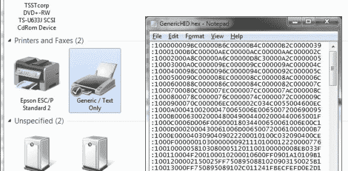

# 微控制器枚举为 USB 打印机—可通过打印进行编程

> 原文：<https://hackaday.com/2013/05/10/microcontroller-enumerates-as-usb-printer-can-be-programmed-by-printing/>

这是一个迷人的概念。我们不确定它的有用性，但就概念而言，它绝对是独立的。[Dean Camera]刚刚在 LUFA 项目中增加了一个新的 HID 类，可以让你通过打印 AVR 芯片来刷新它们。这意味着一旦你有了一个像上面记事本中打开的文件，你只需点击文件，然后点击打印，固件就会上传到芯片上。

[Dean]是 LUFA 项目的创始人，他仍然喜欢亲自参与这个项目。这个想法是他在探索使用 MIDI 协议对芯片编程的概念时产生的。这并没有成功，因为微软在新版 Windows 中处理 MIDI 的方式。但他确实想到了让 LUFA 把自己定位成一台简单的 USB 打印机。他钻研了说明书，并想出了如何做到这一点。一旦 Windows 连接到设备，它并不真正关心什么数据发送给它。所以[Dean] [为 bootloader](https://github.com/abcminiuser/lufa/tree/master/Bootloaders/Printer) 写了一个解析器，它可以接受输入的十六进制代码并将其写入芯片的程序存储器。