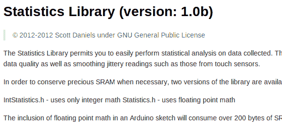

# SRAM 尺寸小的微控制器统计数据

> 原文：<https://hackaday.com/2013/01/14/microcontroller-statistics-with-a-small-sram-footprint/>

您可能知道如何使用最喜欢的微控制器的寄存器，但在某种程度上，您还需要运用一些忍者级的数学技能来管理小型设备上的数据数组。[斯科特·丹尼尔斯]在这个竞技场上对你有些帮助。他解释了如何在不耗尽所有内存的情况下对你收集的数据进行统计计算。他[提供的](https://github.com/provideyourown/statistics)库是针对 Arduino 的。但是他解释得很好的概念应该很容易移植到您喜欢的硬件上。

他在帖子开头概述的情况是，数据是从传感器收集的，但由收集设备处理(与数据记录器相反，在数据记录器中，您可以转储保存的数据，并使用计算机进行繁重的工作)。这可以采用触摸传感器的形式，众所周知，当查看单个读数时，触摸传感器会有很多噪声。但是由于[Scott]使用平均值和标准差来保存一段时间内收集的数据总量，这对于像[建造你自己的家庭加热恒温器](http://hackaday.com/2011/10/27/diy-thermostat-keeps-the-harsh-winter-cold-at-bay/)这样的应用也是非常有用的。