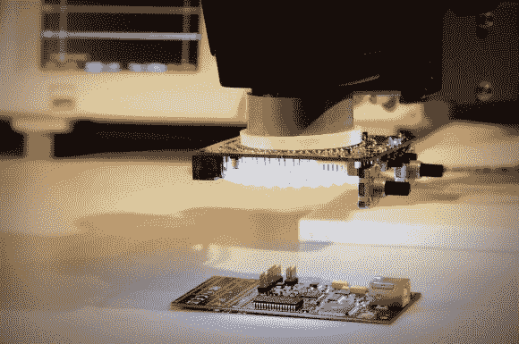

# 具有多种不同功能的显微镜环形灯

> 原文：<https://hackaday.com/2013/04/03/microscope-ring-light-with-a-number-of-different-features/>

显微镜放大光。有意义的是，有更多的光线从物体上反射会产生更好的放大图像。所以我们来找阿齐兹！轻！这是【史蒂夫的】[立体显微镜的 LED 灯环](http://www.tangentaudio.com/2013/03/aziz-light/)。这也是我们最喜欢的科幻电影之一的[呼喊。](http://www.youtube.com/watch?v=mvwd13F_1Gs)

他不是在摆弄这台显微镜。我们已经看到了他的[定制支架](http://hackaday.com/2013/02/20/the-perils-of-buying-a-stereo-microscope-without-a-stand/)和[相机附件](http://hackaday.com/2013/03/12/camera-adapter-for-a-microscope/)。这也不例外。该设备使用他设计的 fab-house PCB。它拥有双环白色发光二极管。但是控制并不是简单地随着开关而停止。他包括两个旋转编码器，三个瞬时按钮开关，和三个 led 作为用户界面。休息过后，他的演示视频中展示了这一切。

ATtiny1634 负责控制该设备。打开时，它会将灯光逐渐调至中等亮度。这可以用一个旋转编码器来调整。如果有阴影或其他问题，可以使用一个按钮来改变模式，允许旋转编码器选择不同的照明模式来补救这种情况。驱动 led 内环和外环甚至有不同的设置。

我们没有和任何高端光学显微镜合作过。这些功能是商用硬件上才有的，还是[史蒂夫]在这里开辟了新的天地？

[https://www.youtube.com/embed/FG3j__eGHW0?version=3&rel=1&showsearch=0&showinfo=1&iv_load_policy=1&fs=1&hl=en-US&autohide=2&wmode=transparent](https://www.youtube.com/embed/FG3j__eGHW0?version=3&rel=1&showsearch=0&showinfo=1&iv_load_policy=1&fs=1&hl=en-US&autohide=2&wmode=transparent)