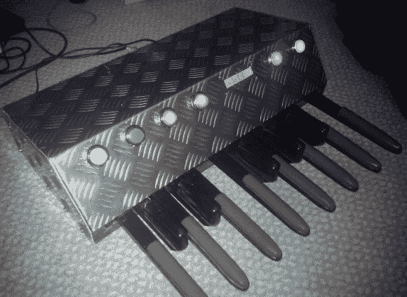

# MIDI 踏板项目看起来和听起来一样好

> 原文：<https://hackaday.com/2013/04/10/midi-pedal-project-looks-as-good-as-it-sounds/>

[李·安东内尔]正在展示他的 MIDI 风琴踏板版本。我们最近看到了一些这样的例子。风琴踏板是一个很好的切入点，因为它们很容易以电子方式连接，并且旨在承受你的脚的击打，从另一侧出来也不会磨损。这个版本在功能和完成上都超越了[我们最喜欢的 MIDI 踏板转换之一](http://hackaday.com/2012/04/24/making-old-organs-more-portable-with-midi/)。

Arduino Nano 将这个项目整合在一起。它不断扫描踏板，并将按键转换成 MIDI 信号。但这个设计包括这个看起来很棒的前端，在切割和弯曲他自己的铝踏板之前，[李]首先在纸板上制作原型。两行字符显示器提供了一个菜单系统，但按钮本身根据每个按钮内部的光的行为充当反馈。这方面的一个例子在广告之后的演示视频中有所展示。蓝色按钮在复音和单音模式之间切换，后者的灯光渐亮渐暗。

[https://www.youtube.com/embed/OSXKp1mswxA?version=3&rel=1&showsearch=0&showinfo=1&iv_load_policy=1&fs=1&hl=en-US&autohide=2&wmode=transparent](https://www.youtube.com/embed/OSXKp1mswxA?version=3&rel=1&showsearch=0&showinfo=1&iv_load_policy=1&fs=1&hl=en-US&autohide=2&wmode=transparent)