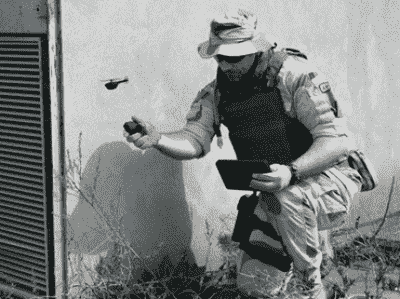

# 军方窃取了任何把手机摄像头绑在四轴飞行器上的人的想法

> 原文：<https://hackaday.com/2013/02/05/military-steals-idea-of-anyone-who-ever-tied-a-cellphone-camera-to-quadcopter/>

看看这个焊料使用的玩具。这是一架小型遥控直升机。这个东西是在一个套件中，包括一个小平板电脑，通过它可以查看鼻架相机的图像。这些是英国军队在阿富汗使用的。目的是通过允许步兵执行离散侦察来帮助保护步兵。你愿意为这种救生技术支付多少钱？[3100 万美元购买 160 台听起来如何](http://rt.com/news/black-hornet-nano-drone-378/)？对于这个价格，我们期望[八个螺旋桨和一个电影质量的相机](http://hackaday.com/2011/10/12/sweet-octocopter-takes-the-red-epic-to-new-heights/)。

无人机是由 Prox Dynamics 制造的[。它们自 2008 年以来一直在开发中，你可以打赌，很多时间都花在了让它“听不见”上，这是我们看到的这个版本和业余爱好制作的版本之间的主要区别。现在，你将不得不尝试自己制作，因为他们只会卖给政府。](http://www.proxdynamics.com/products/pd_100_prs/)

谈到视频，我们能为你做的最好的事情是制作 2009 年的原型镜头(休息后)。如果你有一个新片段的链接，我们希望在评论中看到它。

[https://www.youtube.com/embed/FBxmck16FhA?version=3&rel=1&showsearch=0&showinfo=1&iv_load_policy=1&fs=1&hl=en-US&autohide=2&wmode=transparent](https://www.youtube.com/embed/FBxmck16FhA?version=3&rel=1&showsearch=0&showinfo=1&iv_load_policy=1&fs=1&hl=en-US&autohide=2&wmode=transparent)

[via [Reddit](http://www.reddit.com/r/arduino/comments/17vjsh/31m_cmon_guys_we_can_totally_do_this/)