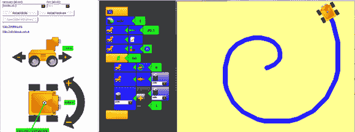

# MiniBloq IDE，适用于各种尺寸的机器人的图形编程

> 原文：<https://hackaday.com/2014/05/08/minibloq-ide-graphical-programming-for-robots-of-all-sizes/>

Arduino IDE 只会引起实际 EEs 和更了解它的人的愤怒，但是如果你正在教孩子们机器人和编程，你真的不想要像带有“编译”按钮的文本编辑器这样简单的东西。对于这一教育壮举，一个图形系统会更适合。[Julián]已经工作了几个月来构建这样一个工具，现在 miniBloq，一个几乎适用于所有开发板的图形编程工具，[发布了一个新版本](http://blog.minibloq.org/2014/05/minibloqv082-released.html)。

机器人图形化编程语言的想法以前就有过，最令人难忘的是乐高思维风暴编程接口。当然，这是封闭的源代码，只适用于神奇的乐高积木，它允许你在孩子的作品上安装马达和传感器。miniBloq 采用了相同的想法，允许相同的编程环境与许多不同形状和大小的机器人开发板一起工作。Pi-Bot、SparkFun RedBot、Maple、Multiplo DuinoBot 和任何基于 Arduino Leonardo 的东西都可以与 miniBloq 一起工作，任何理解 C/C++、Python 或 JavaScript 的未来开发板也是如此。它不仅仅是为电机供电:有几个 Python 和 OpenCV 教程演示了机器人如何用相机跟踪彩色物体。

miniBloq 的当前版本可以从 gits 下载[，版本可用于 Windows 和*nix。IDE 是用 wxWidgets 编写的，所以也可以很容易地移植到 OS X。](https://github.com/miniBloq)