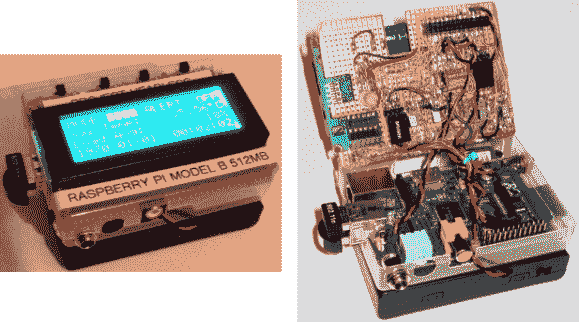

# 无头 Raspberry Pi 应用程序的极简用户界面

> 原文：<https://hackaday.com/2013/03/13/minimalist-user-interface-for-headless-raspberry-pi-applications/>

[Jason Birch]刚刚为树莓派完成了一个漂亮简单的用户界面。我们的目标是保持它的小巧和直观，同时仍然提供一系列的功能。他的附加硬件使用几个发光二极管和一个四行字符液晶显示屏提供反馈。它仅使用四个瞬时按压开关来提供控制。

附加硬件的基础是一块与 Pi 本身大小相同的原型板。这只是比 LCD 屏幕稍微宽一点，沿着顶部为一排按钮留出空间，按钮之间有不同颜色的 led。仔细观察点对点布线，您会发现与 RPi GPIO 接头匹配的双插脚插座。[Jason]的一条重要提示提到，LCD 屏幕 R/W 引脚必须接地。这可以防止它进入读取模式，否则会在 I/O 引脚上产生 5V 电压，从而可能损坏 RPi 上的 3.3V 容差接头。

再加上一块电池，硬件就足够了。要了解他是如何使用它的，您需要在休息后观看视频剪辑。

[https://www.youtube.com/embed/qPl3tUVybfA?version=3&rel=1&showsearch=0&showinfo=1&iv_load_policy=1&fs=1&hl=en-US&autohide=2&wmode=transparent](https://www.youtube.com/embed/qPl3tUVybfA?version=3&rel=1&showsearch=0&showinfo=1&iv_load_policy=1&fs=1&hl=en-US&autohide=2&wmode=transparent)

[谢谢汤姆]