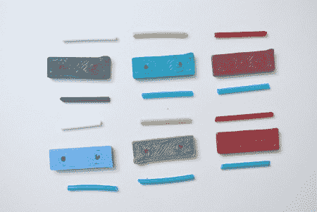

# 在 Reprap 上混合颜色

> 原文：<https://hackaday.com/2012/05/18/mixing-colors-on-the-reprap/>

3d 打印在构建精细物体的能力方面取得了巨大进步。不幸的是，颜色仍然是一个相当大的限制。在这里，Reprap 博客的一些人正兴致勃勃地想出一个[挤出机头，它实际上混合了两种颜色，因为它沉积了它们](http://blog.reprap.org/2012/04/colour-mixing.html)。不要将这与 Makerbot 吹捧的双头混淆，它允许你在飞行中切换颜色，这是一个单头，实际上有一个空腔，材料在这里熔化，然后搅拌，以创建两者的组合。这是一种克服颜色供应有限的有趣方法。

有了这个额外的搅拌室意味着当你想改变颜色的时候会有少量的材料被浪费，因为它必须被清除。在他们关于如何最有效地利用这些额外材料的评论中，有一些有趣的想法。