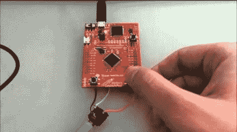

# Stellaris 发射台的 MOD 播放器

> 原文：<https://hackaday.com/2012/11/28/mod-player-for-the-stellaris-launchpad/>

【Ronen k .】来信告诉我们关于[他最近完成的 MOD 玩 Stellaris Launchpad 项目](http://mobile4dev.blogspot.co.il/2012/11/stellaris-launchpad-mod-player.html)。MOD 是一种声音文件，适用于早已过时的计算机。但是你肯定会认出这个设备发出的 8 位好的声音。

为了理解一个 MOD 文件是如何存储样本的，你可能想浏览一下维基百科页面。有很多这样的文件，但是这种实现只适用于只有四个通道的文件。目前唯一使用的外部硬件是一个音频插孔，它需要一个接地连接和两个音频通道上的 PWM 信号。[Ronen]将文件存储在闪存中，而不是使用 SD 卡或其他外部存储设备。这为最多六个文件留下了 213k 的空间，用户可以通过在列表中向前或向后循环的按钮来选择这些文件。休息后请看演示。

该项目从 STM32 应用程序移植现有代码。因为它也是 ARM 微控制器，所以不需要做太多工作。但是他必须为这个芯片编写所有的 PWM 功能。[这个 PWM 教程](http://hackaday.com/2012/10/31/pwm-on-the-stellaris-launchpad/)在这个过程中非常有用。

[https://www.youtube.com/embed/-8_fD3Wbxiw?version=3&rel=1&showsearch=0&showinfo=1&iv_load_policy=1&fs=1&hl=en-US&autohide=2&wmode=transparent](https://www.youtube.com/embed/-8_fD3Wbxiw?version=3&rel=1&showsearch=0&showinfo=1&iv_load_policy=1&fs=1&hl=en-US&autohide=2&wmode=transparent)