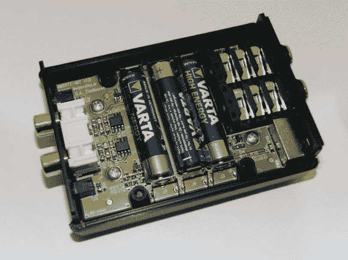

# 调制器盒将 IPod 连接到特斯拉线圈

> 原文：<https://hackaday.com/2013/01/30/modulator-box-connects-ipod-to-tesla-coil/>

这个直通音频调制器[可以让你在两个特斯拉线圈](http://www.megavolts.nl/en/projecten/tesla-spoelen/168-stereo-audio-modulator-for-my-sstcs)上播放立体声音频。但是不要担心，如果你手头只有一个线圈，你可以只使用单声道文件。一侧有连接到音频源的输入。另一端驱动特斯拉线圈，根据参考电压和音频信号之间的关系开关线圈。正如你在休息后的视频中听到的，只要你有正确的源音频，这听起来很棒。

该片段中播放的歌曲是杜克核爆 3D 主题。[Daniel]从一个 MIDI 文件开始，去掉了编钟和鼓，使回放更清晰一些。演示只使用了一个线圈，因为在测试期间，当两个线圈之间的反馈出现问题时，另一个线圈被破坏了。

出于某种原因，这让我们想起了那个唱歌的特斯拉线圈帽。如果你已经在我们的[邮件列表](http://hackaday.com/2013/01/25/announcing-hackaday-videos-and-behind-the-scenes-mailing-list/)(在侧边栏注册)上，你知道我们很快就要推出我们自己的令人敬畏的特斯拉线圈项目了。它不会唱歌…还不会。

[https://www.youtube.com/embed/T9zGuURkwrs?version=3&rel=1&showsearch=0&showinfo=1&iv_load_policy=1&fs=1&hl=en-US&autohide=2&wmode=transparent](https://www.youtube.com/embed/T9zGuURkwrs?version=3&rel=1&showsearch=0&showinfo=1&iv_load_policy=1&fs=1&hl=en-US&autohide=2&wmode=transparent)