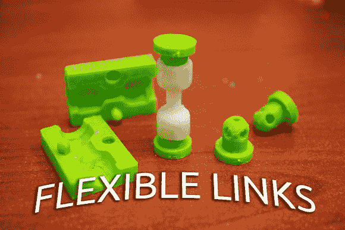

# 模制柔性链节

> 原文：<https://hackaday.com/2013/08/28/molding-flexible-links/>

需要一个强大而灵活的自定义链接？[RobotGrrl]想出了一个方法[使用 3D 打印零件和 Sugru 成型柔性连杆](http://robobrrd.com/learn/flexiblelinks/ "Molding Flexible Links")。

该链接由两个 3D 打印的轮毂组成，由 3D 打印模具中铸造的柔性材料连接。[RobotGrrl]建议使用 Sugru 来创建链接，但您可以使用自制的 [Oogoo](http://hackaday.com/2010/10/11/oogoo-a-home-made-sugru-substitute/ "Oogoo, a home-made Sugru substitute") 作为低成本的替代品。洗碗精被用作脱模剂，防止糖粘在模具上。

该教程包括在 Autodesk Inventor 中建模零件的详细指南，可作为 CAD 工具的快速介绍。如果你只是想做一些链接，STL 文件可以立即进行 3D 打印。

为什么你会想要自己动手做灵活的链接？[RobotGrrl]的 [Baitbot](http://robobrrd.com/tentacle/ "Baitbot") 就是一个很好的例子。这个触须机器人以连杆为核心。休息之后，看看诱饵机器人扭动的视频。

[https://www.youtube.com/embed/ulH5jR0e9Sk?version=3&rel=1&showsearch=0&showinfo=1&iv_load_policy=1&fs=1&hl=en-US&autohide=2&wmode=transparent](https://www.youtube.com/embed/ulH5jR0e9Sk?version=3&rel=1&showsearch=0&showinfo=1&iv_load_policy=1&fs=1&hl=en-US&autohide=2&wmode=transparent)