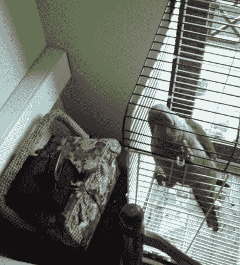

# 使用树莓 Pi 监控病鸟

> 原文：<https://hackaday.com/2013/07/25/monitoring-a-sick-bird-using-the-raspberry-pi/>

[Jorge Rancé]正在护理一只生病的鸟恢复健康。他在街上发现它的一条腿骨折了，需要一个迷你石膏模型才能正确愈合。但是长时间离开家会感觉不舒服。他抓起一些简单的硬件，轻松地建造了一个互联网连接的鸟类监测系统。这真的只是一个玩弄他的树莓派的借口，但谁能怪他呢？

网络摄像头增加了视频监控功能，使用名为“motion”的 Linux 软件来传输视频。这是我们旅行时和我们的猫用的同一个包裹；它提供连续的实时流，但也可以在检测到运动时保存记录。他增加了一个 USB 温度传感器，并在 GPIO 头上安装了一个水位传感器。这些照片会自动采集，同时还有来自网络摄像头的静态图像，并使用 bash 脚本每小时发布一次。他只需要研究出自动分配食物和水的方法，他永远不需要回家！鸟食应该不会比鱼食难做，对吧？