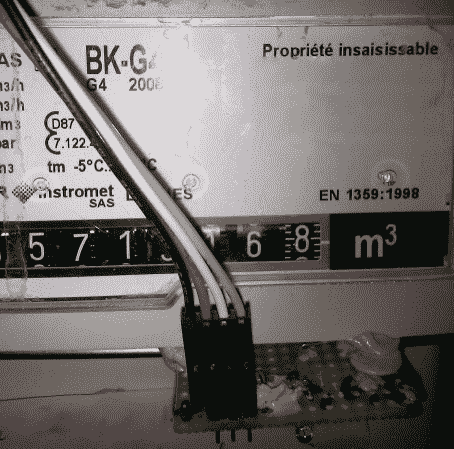

# 使用 JeeNode 和 NRF24L01+监控您的油耗

> 原文：<https://hackaday.com/2014/03/23/monitoring-your-gas-consumption-with-a-jeenode-and-a-nrf24l01/>

[Sven337]刚刚在博客上写了一个他不久前完成的[油耗监控设置](http://perso.aquilenet.fr/~sven337/english/2014/03/18/Gas-meter-monitoring-wireless-battery-arduino.html)。由于他的煤气表位于他的公寓外面，离任何电源插座都很远，所以需要一个电池供电的平台，可以将当前的消耗数据无线发送到他的 Raspberry Pi。因此，他的最终解决方案是由一个 [JeeNode](http://jeelabs.net/projects/hardware/wiki/JeeNode) 和众所周知的 nRF24L01+无线发射器组成，由 3 节据说是用完的碱性电池供电。

[Sven337]仔细研究了从他的仪表中读取数据的不同技术。起初，他想到用一个反射传感器来检测数字 6，这个数字(至少在法国)被设计成能很好地反射光线。然后，他最终满足于基于磁性的解决方案，因为 Actaris G4 气体流量计有一个用于磁性传感器的小凹陷。因此，你在上图中看到的 PCB 有一个簧片传感器和一个调试 LED。四根电线连接到一个塑料外壳，里面有 JeeNode、几个 led 和一个复位开关。使用另一个 nRF24L01，Raspberry Pi 最终接收脉冲计数，并将其报告给负责存储和绘图的 eeePC。