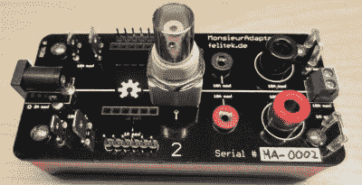

# 适应者先生:所有连接器行业的雅克

> 原文：<https://hackaday.com/2015/08/21/monsieur-adaptateur-jacques-of-all-connector-trades/>

似乎只要你在工作台上有电路，就会有电线。很多电线。如果你正在做一些新的东西，最好用一些现场权宜之计将其中一些电线夹到其他电线上，尤其是电源线。我们经常看到鳄鱼夹笨拙地抓住 BNC 的外壳。[Felicitus]对此感到厌倦，所以他创造了[Monsieur adapteur](http://felitek.de/monsieur-adaptateur/)，这是一个分线板，它有你在制作原型时需要的通用连接器。

什么样的连接器？

*   DC 插孔 2.1 毫米
*   2mm 插孔
*   4 毫米插孔
*   BNC 连接器
*   接线盒
*   示波器探头连接器
*   标准 6 针 0.1 英寸母接头
*   标准 6 针 0.1 英寸外螺纹接头
*   4.75 毫米和 6.3 毫米刀片式连接器

双导线项目(如 2.1 毫米插孔和 BNC)连接到电路板的两侧。其他连接器是成对的。例如，您可以将 BNC 电缆从信号发生器连接到公接头上的一些跳线，将示波器连接到示波器探头连接器，并且仍然有香蕉插孔来连接数字仪表。

没有人会说这将改变世界，但这是一件简单但非常有用的事情。这些计划都在 [Github](https://github.com/felicitus/MonsieurAdaptateur) 上，显然你可以根据自己的具体情况使用合适的连接器。

我们不确定这款主板能否驯服像视频中那样的布线混乱，它也不会帮助你[用数百根电线](http://hackaday.com/2013/03/21/nandputer-is-mostly-wiring/)做一个整洁的布线工作，但这不会有什么坏处。

[https://www.youtube.com/embed/Yr-TtvxrGWQ?version=3&rel=1&showsearch=0&showinfo=1&iv_load_policy=1&fs=1&hl=en-US&autohide=2&wmode=transparent](https://www.youtube.com/embed/Yr-TtvxrGWQ?version=3&rel=1&showsearch=0&showinfo=1&iv_load_policy=1&fs=1&hl=en-US&autohide=2&wmode=transparent)