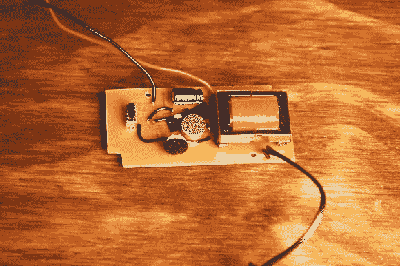

# 几个月的失败导致这个 EL 面板调光器随着音乐跳动

> 原文：<https://hackaday.com/2012/12/19/months-of-failure-lead-up-to-this-el-panel-dimmer-that-pulses-to-the-music/>

早在三月份[Ch00f]就开始了一个雇佣项目，制作一套能随着音乐发光的衣服。他决定围绕一个脉动的电致发光面板建造一些东西。他花了很多时间，尝试了一些不同的技术，但最终他有了一个可以工作的 EL 面板调光器。

这是一个我们一直关注的传奇。这种下降似乎对他有利，在使用三端双向可控硅开关失败后，他设法通过[扰乱流向驱动器振荡器](http://hackaday.com/2012/10/03/how-to-dim-el-wire-current-limiting-the-oscillator/)的电流来调整一些 EL 线的亮度。站在成功的肩膀上，他认真对待音频信号处理，设计了上面看到的电路板。板上有一个麦克风，它拾取声音，然后处理成信号，负责 EL 面板的亮度。

休息后有一个演示视频，但你会想深入研究他的文章，以获得所有的细节。

[https://www.youtube.com/embed/bBZD849oG9g?version=3&rel=1&showsearch=0&showinfo=1&iv_load_policy=1&fs=1&hl=en-US&autohide=2&wmode=transparent](https://www.youtube.com/embed/bBZD849oG9g?version=3&rel=1&showsearch=0&showinfo=1&iv_load_policy=1&fs=1&hl=en-US&autohide=2&wmode=transparent)

[via [Reddit](http://www.reddit.com/r/ECE/comments/150a4e/i_finally_got_my_soundreactive_el_panel_power/)