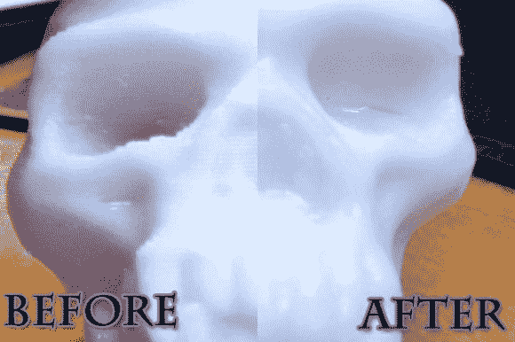

# 更多丙酮蒸汽抛光实验

> 原文：<https://hackaday.com/2013/03/02/more-acetone-vapor-polishing-experiments/>

如果你正在考虑尝试丙酮蒸汽抛光工艺来平滑你的 3D 打印物体，你必须简单地检查一下[Christopher 的][工艺的实验](http://www.trenchphysics.com/?p=41)。几天前他从[我们的专题](http://hackaday.com/2013/02/26/giving-3d-printed-parts-a-shiny-smooth-finish/)中了解到了这个过程，并决定在不同的打印模型上进行一系列实验。

结果喜忧参半。他以与最初提供几乎相同的方式执行该过程。上面看到的头骨很好地展示了这个过程可以达到的效果。有一个光滑的光泽完成，并[克里斯托弗]认为没有损失细节。但是他测试的三个模型中有一个并没有受到蒸汽的影响。他认为它变得更亮了一点，但还没有头骨亮那么多，即使它经过了两次处理。我们很想听到一些关于原因的讨论。

有大约八分钟的视频来配合项目发布。跳完之后你会找到的。

[https://www.youtube.com/embed/z7083xw9I7o?version=3&rel=1&showsearch=0&showinfo=1&iv_load_policy=1&fs=1&hl=en-US&autohide=2&wmode=transparent](https://www.youtube.com/embed/z7083xw9I7o?version=3&rel=1&showsearch=0&showinfo=1&iv_load_policy=1&fs=1&hl=en-US&autohide=2&wmode=transparent)