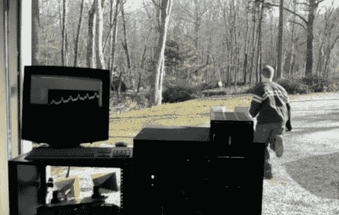

# 更多连续波雷达乐趣

> 原文：<https://hackaday.com/2012/11/20/more-continuous-wave-radar-fun/>

[Gregory Charvat]继续享受测试雷达系统的美好时光。他和一个朋友将雷达指向车库门外，并用它来看谁能达到更高的跑步速度。

上次我们查看[Greg]的工作时，他已经[获得了一个旧的警用雷达装置，并将其与笔记本电脑](http://hackaday.com/2012/11/01/hacking-an-old-radar-gun-to-interface-with-a-laptop/)连接起来使用。他现在使用的硬件体积大得多，我们认为它不会很快与他一起上路(尽管它是有轮子的)。休息后的视频开始概述安装在齐腰高的机架上的测试系统。他展示了 Labview 如何监控雷达输入，然后展示了实际采集数据的硬件。这个盒子非常通用，能够运行五种不同的系统，包括一系列不同的连接器类型。

[https://www.youtube.com/embed/Yze_cFdiOH8?version=3&rel=1&showsearch=0&showinfo=1&iv_load_policy=1&fs=1&hl=en-US&autohide=2&wmode=transparent](https://www.youtube.com/embed/Yze_cFdiOH8?version=3&rel=1&showsearch=0&showinfo=1&iv_load_policy=1&fs=1&hl=en-US&autohide=2&wmode=transparent)