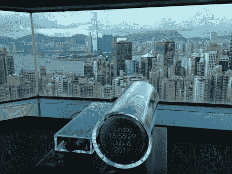

# 示波器时钟带来更多 CRT 乐趣

> 原文：<https://hackaday.com/2012/11/07/more-crt-fun-with-the-scope-clock/>

这是一种使用旧示波器零件的性感方式。[Aaron]他的灵感来自另一个项目，该项目使用旧示波器的 CRT。现在他用[回馈了一个致力于分享示波器时钟](http://oscilloclock.com/)信息的网站。这个项目与我们前几天看到的[项目](http://hackaday.com/2012/11/05/custom-circuit-drives-a-small-round-crt-display/)是一个思路。

上图展示了他在香港新家的第一个建筑。这个时钟被安置在两个透明的丙烯酸容器中，通过一个令人惊讶的结实的军用级连接器配对。你可以通过上面链接的页面顶部的原型标签看到它完成这个完美的过程。其中一张图片展示了一些屏幕重绘的快速截图。它可以让你看到电子枪在荧光屏上跟踪的向量。这给出了一个我们认为比传统 CRT 显示器的行扫描更令人愉快的图像。

当然你也没有一个从头开始。这是一个时钟项目，它只是增加了一个功能性的 CRT 作用域。