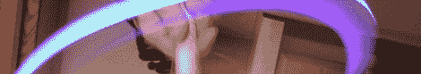

# 更 LED 疯狂！

> 原文：<https://hackaday.com/2012/09/12/more-led-maddness/>

所以上周[Caleb]发布了一篇关于[黑掉一个浮动 LED 球](http://hackaday.com/2012/09/08/hacking-a-floating-rgb-led-decorative-ball/ "Hacking a floating RGB ball")的文章。作为回应，这里有几个我最近想到的简单的 LED 黑客或再利用。

**LED 太阳能发光立方体:**如果你见过照亮人们花园或人行道的道路灯，你可能会想知道它们有什么成分，以及[它们如何被重新利用](http://www.jcopro.net/2012/07/22/a-diffuse-glow-cube-from-a-solar-path-light/ "How to make a diffuse LED solar light cube")。正如本文所示，除了一块电路板、充电电池，当然还有一块太阳能电池板之外，没有太多其他东西。把这个和一些有洞的剩余泡沫结合起来，你就有了上图所示的装置。真的很简单，但结果很酷，就像休息后在视频中看到的那样。

**LED 双截棍:**如果你以为车轮灯只针对真实的车轮，那么你就没见过这些用一些 PVC 管和加速度感应车轮灯建造的[双截棍。这可能算不上什么“黑客”，因为它们很容易制作，但结果却很整洁，很有趣，甚至可以用在长曝光摄影中。看看这些双截棍动作后的视频和一些可以用它们制作的](http://www.jcopro.net/2012/08/26/how-to-make-a-led-light-nunchuck-set/ "Wheel lights nunchucks") [LED 灯画](http://www.jcopro.net/2012/08/28/light-painting-with-led-pvc-nunchucks/ "light paintings made with LED nunchucks")。

[https://www.youtube.com/embed/RD2sypP8Wr4?version=3&rel=1&showsearch=0&showinfo=1&iv_load_policy=1&fs=1&hl=en-US&autohide=2&wmode=transparent](https://www.youtube.com/embed/RD2sypP8Wr4?version=3&rel=1&showsearch=0&showinfo=1&iv_load_policy=1&fs=1&hl=en-US&autohide=2&wmode=transparent) [https://www.youtube.com/embed/ec1q-DRk-30?version=3&rel=1&showsearch=0&showinfo=1&iv_load_policy=1&fs=1&hl=en-US&autohide=2&wmode=transparent](https://www.youtube.com/embed/ec1q-DRk-30?version=3&rel=1&showsearch=0&showinfo=1&iv_load_policy=1&fs=1&hl=en-US&autohide=2&wmode=transparent) [https://www.youtube.com/embed/GuZVUd6S_Yw?version=3&rel=1&showsearch=0&showinfo=1&iv_load_policy=1&fs=1&hl=en-US&autohide=2&wmode=transparent](https://www.youtube.com/embed/GuZVUd6S_Yw?version=3&rel=1&showsearch=0&showinfo=1&iv_load_policy=1&fs=1&hl=en-US&autohide=2&wmode=transparent)