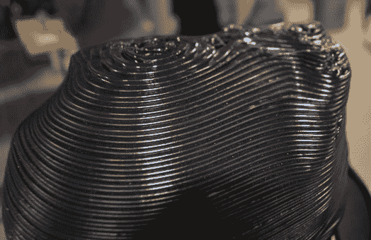
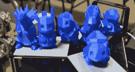
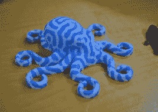
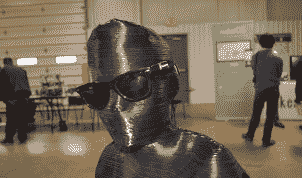
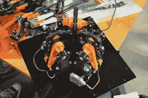
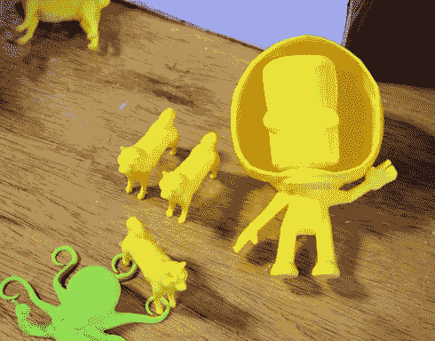

# 更多 MRRF，这次是圆桌会议

> 原文：<https://hackaday.com/2015/04/02/more-mrrf-this-time-a-roundtable/>

啊，你以为我们已经报道完中西部说唱节了，是吗？不，还有更多的，感谢[蒂莫西·科斯切尔尼]送来一些数字资产，这些资产是把这篇文章放在一起所必需的。这一次，是与来自 [Ultimachine 的【约翰尼·鲁塞尔】、](https://ultimachine.com/)、 [MakerJuice 的【沙恩·格雷伯】、](https://www.makerjuice.com/) [MatterHackers 的【拉斯·布鲁贝克】、](http://www.matterhackers.com/) [E3D 的【桑杰·莫蒂默】——在线](http://e3d-online.com/)的 RepRap 圆桌会议。

[第一个视频](https://www.youtube.com/watch?v=eSUjbwJOs88)介绍了这些非常著名的 3D 打印机开发人员，以及他们对 3D 打印机未来发展的看法，Delta、Cartesian 和 Polar 机器人之间的差异(数量不多)，以及树脂打印机何时开始兴起。

在问答环节，专家小组回答了观众的一些问题。问题包括如何让人们进入 3D 建模，一个*惊人的*问题涉及我们*应该*制造什么(暗示我们只制造[愚蠢的塑料小饰品](http://hackaday.io/project/4032-the-original-low-poly-pokemon)，以及需要做什么工作才能将 3D 打印带给大众。

特别感谢来自 92.3 WOWO 的凯西·亨德里克森主持 RepRap 圆桌会议，感谢蒂莫西·科斯切尔尼的音频工作。但不是这样:休息过后，我还需要转储一些图片。

[https://www.youtube.com/embed/eSUjbwJOs88?version=3&rel=1&showsearch=0&showinfo=1&iv_load_policy=1&fs=1&hl=en-US&autohide=2&wmode=transparent](https://www.youtube.com/embed/eSUjbwJOs88?version=3&rel=1&showsearch=0&showinfo=1&iv_load_policy=1&fs=1&hl=en-US&autohide=2&wmode=transparent)

[https://www.youtube.com/embed/XB53h0fQDgM?version=3&rel=1&showsearch=0&showinfo=1&iv_load_policy=1&fs=1&hl=en-US&autohide=2&wmode=transparent](https://www.youtube.com/embed/XB53h0fQDgM?version=3&rel=1&showsearch=0&showinfo=1&iv_load_policy=1&fs=1&hl=en-US&autohide=2&wmode=transparent)

  The layers of the tweenage PartDaddy print  Starter Pokemon. See what I mean about Porygon?  A not-rocktopus printed on E3D’s Cyclops nozzle  How YOU doin’?  The mechanics of the FirePick Delta  Kerbals!

虽然与 3D 打印没有任何关系，但来自 Angstron Materials 的一名代表来到了 MRRF。他们是做什么的？

  Who’s building a PC soon?  Holy crap.

我们对石墨烯的幻想破灭了。真的，你所需要做的就是在《连线》杂志的头版上提到石墨烯。是的，太空电梯，但是有太多的宣传*。我更喜欢对任何与石墨烯有关的事情持保留态度。也就是说，石墨烯超级电容的体积可能只有 20x30x5mm，如果我能做好 wolfram alpha 的话，它的容量大约和我的手机一样多。我的手机是垃圾，但仍然…*

 *我有一些石墨烯导热膏。未来可能会有实验室检测。*