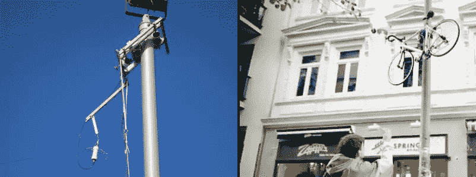

# 更多爬杆机器人、拖运天线和自行车

> 原文：<https://hackaday.com/2014/08/09/more-pole-climbing-bots-haul-antennas-and-bikes/>

前几天我们发布了一个[爬杆装置](http://hackaday.com/2014/08/06/pole-climbing-device-runs-up-flags-and-undies/)。从那以后，我们收到了一些关于其他登山者的建议的电子邮件。我们将在这里讨论其中的两种，它们彼此完全不同，有着完全不同的用途。谁知道外面有这么多爬杆机器人？

首先，这是一个挥舞着天线的机器人，它爬上电线杆以促进空中通信。该系统被称为 [E-APS](http://wc2fd.com/index.php?title=Emergency_Antenna_Platform_System) (紧急天线平台系统)，被爱好者用来将任何 ol '停车场灯柱变成天线塔。这台特殊的机器有一个由挤压铝制成的大矩形框架。有四个轮子，其中两个是由一个看起来像汽车电动车窗电机驱动的。天线的重量迫使每组两个轮子压在电线杆的相对两侧，产生足够的摩擦力，不仅支撑该装置，还允许它在电线杆上上下移动。没有很多关于建造的解释，但是有很多最终产品的[细节照片](http://wc2fd.com/index.php?title=EAPS_Detailed_Photos)。我们在 2013 年纽约 MakerFaire 展会上看到了 E-APS 的应用，印象非常深刻。

我们之前已经[介绍过](http://hackaday.com/2010/11/29/climbing-bike-storage-thwarts-thieves/)这款下一款设备，但还是值得再提一下。该项目假设没有一把自行车锁足够坚固，足以阻止最顽固的小偷。这种“防盗器”[不是把你的自行车锁起来，期待最好的结果，而是把你的自行车提升到潜在自行车盗窃者够不到的地方](http://www.conrad.de/ce/de/content/ti_fahrradschloss/ti_fahrradschloss)。那么，一旦你的自行车上了杆子，你怎么把它弄下来呢？当然是遥控表链。

休息之后有 2 个关于这些发明的很酷的视频…..

[https://www.youtube.com/embed/kvc0A_cWUCU?version=3&rel=1&showsearch=0&showinfo=1&iv_load_policy=1&fs=1&hl=en-US&autohide=2&wmode=transparent](https://www.youtube.com/embed/kvc0A_cWUCU?version=3&rel=1&showsearch=0&showinfo=1&iv_load_policy=1&fs=1&hl=en-US&autohide=2&wmode=transparent)

[https://www.youtube.com/embed/9L6TWJuRC7I?version=3&rel=1&showsearch=0&showinfo=1&iv_load_policy=1&fs=1&hl=en-US&autohide=2&wmode=transparent](https://www.youtube.com/embed/9L6TWJuRC7I?version=3&rel=1&showsearch=0&showinfo=1&iv_load_policy=1&fs=1&hl=en-US&autohide=2&wmode=transparent)