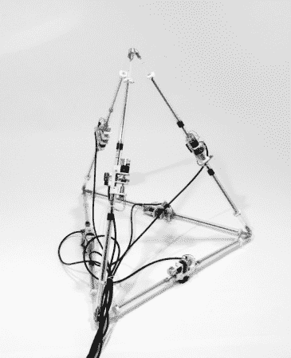

# 变形:自适应空间框架

> 原文：<https://hackaday.com/2013/11/10/morph-adaptive-spaceframe/>

[William Bondin]正在从事一个相当有趣的项目，一个叫做 [Morphs(移动可重构多面体)的四面体变形机器人。](http://vimeo.com/75507483)

它能够通过每个伸缩边缘的延伸而移动，当它变形时，重心会转移，从而使它能够[翻转](http://vimeo.com/70863416)。这远不是一种高效的运动方式，但看起来很有趣！

定制的双向线性致动器旨在确保重量对称分布在每个轴上，它们能够在致动期间将电流降低到约 200mA，这意味着通过一些策略性放置的电池单元，它也能够实现无线传输。原型单元由单个 Arduino 控制，该 Arduino 向每个电机-编码器对发送命令。

[威廉]希望将其发展成为一个全尺寸的建筑原型，并希望到 2015 年，这些互动机器人结构能在公共公园里滚动。建筑的最终目标是允许建筑物对环境输入做出反应，如日光和温度。

迷茫？休息之后请看视频。

[https://player.vimeo.com/video/75507483](https://player.vimeo.com/video/75507483)

[通过[连线](http://www.wired.co.uk/news/archive/2013-11/08/crawling-sculpture)